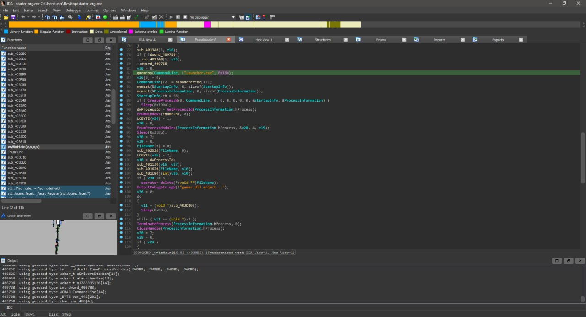
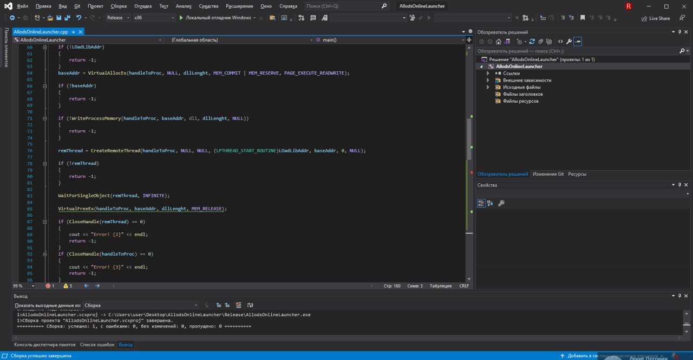

# Allods Online 4.0.02.42 Launcher
It's a simple solution to bypass original launcher update checker and execute game.

So i've researched how AllodsME launcher works: https://community.allods-developers.eu/resources/allodsme-client.47/
 

And i try to write simple starter for AoGame.exe
 

WARNING!
It's not a stable launcher who hooking API.
It's a only game.dll uploader. 
You must be use Launcher.exe with HookDll.dll.
Please, look at ./bin/ directory.
 
