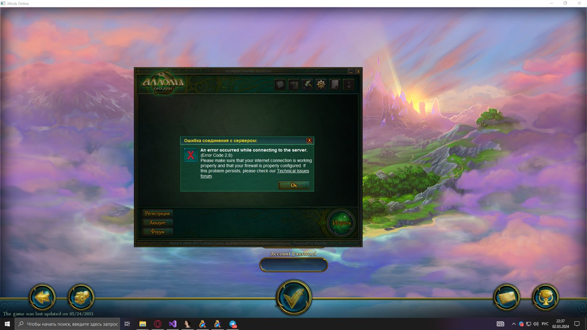

# Allods Online 4.0.02.42 Launcher
It's a simple solution to bypass original launcher update checker and execute game.

So i've researched how AllodsME launcher works: https://community.allods-developers.eu/resources/allodsme-client.47/

And i try to write simple starter for AoGame.exe

## WARNING!
It's not a stable launcher who hooking API.
It's a only game.dll uploader. 
You must be use Launcher.exe with HookDll.dll.
Please, look at ./bin/ directory.

If you want to test Allods Online: http://doh-detection-demo.ru/register/.
So i started Allods Online 4.0.02.42, this server is full free and running 24/7.
Do you need crystals? Pls dm me in Telegram: @Darxis. I'll do it without a problem (update account set money=10000000 where name='....', that's so rly easy).
Enjoy!
